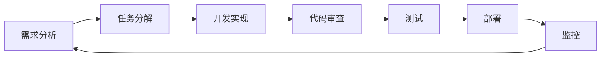

# WebStyle 项目开发路线图

## 版本规划

### v0.1.0 - MVP版本（最小可行产品）- 4周

**目标**：快速验证核心价值，发布可用的基础版本

#### 功能范围

##### 必须完成
- [x] 项目基础架构搭建
- [ ] 用户系统
  - [ ] 用户注册/登录
  - [ ] JWT认证
  - [ ] 基础权限管理
- [ ] 分类管理
  - [ ] 预设10+主流风格分类
  - [ ] 分类列表展示
  - [ ] 分类详情页
- [ ] 网站展示
  - [ ] 网站列表（分页）
  - [ ] 网站详情页
  - [ ] 基础搜索功能
  - [ ] 手动上传截图
- [ ] 管理后台
  - [ ] 网站CRUD
  - [ ] 分类CRUD
  - [ ] 基础数据统计

##### 可选完成
- [ ] 收藏功能
- [ ] 点赞功能
- [ ] 基础数据可视化（ECharts）

#### 交付物
- 可部署的应用程序
- 基础用户文档
- API文档

---

### v0.2.0 - 功能完善版 - 3周

**目标**：完善核心功能，提升用户体验

#### 新增功能

##### 数据可视化
- [ ] 风格趋势分析图（折线图）
- [ ] 风格占比饼图
- [ ] TOP榜单（浏览量/点赞/收藏）
- [ ] 行业风格热力图

##### 搜索与筛选
- [ ] 高级筛选（行业、配色、布局）
- [ ] 关键词高亮
- [ ] 搜索历史
- [ ] 热门搜索

##### 用户体验优化
- [ ] 收藏功能
- [ ] 浏览历史
- [ ] 相似推荐算法
- [ ] 网站详情页增强

#### 技术改进
- [ ] 引入Redis缓存
- [ ] 数据库查询优化
- [ ] 图片懒加载
- [ ] 响应式设计优化

---

### v0.3.0 - 自动化增强版 - 2周

**目标**：提高数据采集效率

#### 新增功能

##### 自动化截图
- [ ] Puppeteer集成
- [ ] URL自动截图
- [ ] 批量截图任务
- [ ] 截图质量优化

##### 内容管理
- [ ] 批量导入工具
- [ ] 网站自动抓取
- [ ] 智能标签推荐
- [ ] 待审核队列

#### 运维改进
- [ ] Celery监控（Flower）
- [ ] 日志收集和分析
- [ ] 性能监控
- [ ] 自动化部署脚本

---

### v0.4.0 - 社区功能版 - 3周

**目标**：增强用户互动，建立社区氛围

#### 新增功能

##### 用户互动
- [ ] 评论系统
- [ ] 点赞系统
- [ ] 用户主页
- [ ] 关注/粉丝功能

##### 内容贡献
- [ ] 用户提交网站
- [ ] 社区审核机制
- [ ] 贡献排行榜
- [ ] 徽章系统

##### 社交分享
- [ ] 社交媒体分享
- [ ] 网站嵌入代码
- [ ] 外部链接追踪

---

### v1.0.0 - 正式版 - 2周

**目标**：产品化，稳定可靠

#### 优化项

##### 性能优化
- [ ] CDN集成
- [ ] 图片压缩和优化
- [ ] 数据库读写分离
- [ ] 负载均衡

##### 安全加固
- [ ] 安全审计
- [ ] 渗透测试
- [ ] 数据备份策略
- [ ] 隐私合规检查

##### 文档完善
- [ ] 完整API文档
- [ ] 用户使用手册
- [ ] 运维文档
- [ ] 故障排查指南

#### 交付物
- 生产级应用
- 完整文档体系
- 运维手册
- 应急预案

---

### v1.1.0+ - 持续迭代

#### 后续方向

##### AI增强
- [ ] AI自动风格识别
- [ ] 智能推荐系统
- [ ] 设计元素自动提取
- [ ] 相似度计算优化

##### 商业化探索
- [ ] 付费高级功能
- [ ] 设计资源商城
- [ ] 设计师入驻
- [ ] 企业版方案

##### 移动端
- [ ] 移动端H5优化
- [ ] 小程序开发
- [ ] 原生APP

##### 国际化
- [ ] 多语言支持
- [ ] 国际设计案例
- [ ] 全球化部署

---

## 里程碑

| 版本 | 时间 | 里程碑 |
|-----|------|--------|
| v0.1.0 | 第4周 | MVP发布，首次用户测试 |
| v0.2.0 | 第7周 | 数据分析功能上线 |
| v0.3.0 | 第9周 | 自动化截图系统完成 |
| v0.4.0 | 第12周 | 社区功能上线，用户破千 |
| v1.0.0 | 第14周 | 正式版发布，网站破万 |

---

## 资源分配

### 开发阶段
- 后端开发：60%
- 前端开发：30%
- 运维/测试：10%

### 角色分工
- **全栈工程师 x 2**：负责核心功能开发
- **前端工程师 x 1**：负责页面和交互
- **测试工程师 x 0.5**：负责质量保证
- **UI设计师 x 0.5**：负责界面设计

---

## 风险管理

### 技术风险

| 风险 | 概率 | 影响 | 应对措施 |
|-----|------|------|---------|
| Puppeteer截图失败率高 | 中 | 高 | 降级到手动上传，提供多种截图方式 |
| 大量图片存储成本高 | 高 | 中 | 使用对象存储+CDN，图片压缩 |
| 并发性能不足 | 中 | 中 | 缓存+读写分离+负载均衡 |
| ECharts大数据渲染慢 | 低 | 低 | 分页加载，后端聚合 |

### 项目风险

| 风险 | 概率 | 影响 | 应对措施 |
|-----|------|------|---------|
| 开发进度延期 | 中 | 中 | 敏捷开发，2周一个迭代 |
| 需求变更频繁 | 高 | 中 | 需求冻结机制，变更评审 |
| 人员变动 | 低 | 高 | 代码规范，文档完善 |

---

## 度量指标

### 开发指标
- 代码覆盖率：> 80%
- Bug密度：< 0.5/KLOC
- 代码审查通过率：> 95%

### 业务指标
- 用户增长率：周环比 > 20%
- 日活跃用户（DAU）：> 100
- 网站收录量：> 1000
- 平均浏览时长：> 3分钟

### 技术指标
- API响应时间：P95 < 200ms
- 页面加载时间：< 2s
- 系统可用性：> 99.5%

---

## 开发流程

### 迭代流程



### 分支策略

```
main (生产环境)
  ↓
release/v1.0.0 (预发布)
  ↓
develop (开发环境)
  ↓
feature/xxx (功能分支)
bugfix/xxx (修复分支)
hotfix/xxx (紧急修复)
```

### 代码规范

- 遵循 PEP 8 Python代码规范
- 使用 Black 格式化代码
- 使用 Flake8 进行代码检查
- 提交信息遵循 Conventional Commits

---

## 测试策略

### 测试金字塔

```
        /\
       /E2E\         端到端测试 (10%)
      /------\
     /  集成  \       集成测试 (30%)
    /----------\
   /    单元     \     单元测试 (60%)
  /--------------\
```

### 测试覆盖

- 单元测试：核心业务逻辑
- 集成测试：API接口
- E2E测试：关键用户流程
- 性能测试：并发和响应时间
- 安全测试：常见漏洞扫描

---

## 部署策略

### 环境划分

- **Development**：本地开发环境
- **Testing**：测试环境（自动化测试）
- **Staging**：预发布环境（UAT测试）
- **Production**：生产环境

### CI/CD流程

```yaml
# .github/workflows/deploy.yml
name: Deploy

on:
  push:
    branches: [ main ]

jobs:
  test:
    runs-on: ubuntu-latest
    steps:
      - uses: actions/checkout@v2
      - name: Run tests
        run: |
          pip install -r requirements.txt
          pytest --cov=app

  deploy:
    needs: test
    runs-on: ubuntu-latest
    steps:
      - name: Deploy to production
        run: |
          docker-compose up -d
```

---

## 文档维护

### 必须维护的文档

- [x] 需求文档（requirement.md）
- [x] 架构设计文档（design.md）
- [x] API文档（Swagger）
- [ ] 数据库文档
- [ ] 运维手册
- [ ] 用户手册
- [ ] 更新日志（CHANGELOG.md）

### 文档更新机制

- 需求变更：同步更新需求文档
- 架构调整：同步更新设计文档
- API变更：自动生成API文档
- 部署变更：更新运维手册

---

## 沟通机制

### 每日站会
- 时间：每天上午10:00
- 时长：15分钟
- 内容：昨天做了什么、今天计划做什么、遇到的问题

### 周例会
- 时间：每周五下午
- 时长：1小时
- 内容：本周进度、下周计划、风险讨论

### 迭代评审
- 时间：每个迭代结束
- 时长：2小时
- 内容：演示功能、收集反馈、总结改进

---

## 学习成长

### 技术分享
- 每两周一次技术分享
- 轮流主讲，主题不限
- 鼓励新技术调研

### 代码审查
- 所有代码必须经过审查
- 至少一人 approve 才能合并
- 记录审查意见，持续改进

---

## 成功标准

### 技术成功
- [ ] 系统稳定运行，可用性 > 99%
- [ ] 性能达标，P95响应时间 < 200ms
- [ ] 代码质量高，测试覆盖率 > 80%

### 产品成功
- [ ] 解决用户痛点，用户反馈正面
- [ ] 功能完整，覆盖核心需求
- [ ] 易于使用，上手门槛低

### 业务成功
- [ ] 用户规模达到预期
- [ ] 用户活跃度高
- [ ] 为后续商业化奠定基础

---

## 总结

本路线图以敏捷开发为指导，遵循"小步快跑、快速迭代"的原则，确保产品持续交付和价值验证。通过明确的里程碑和度量指标，保证项目按计划推进。
